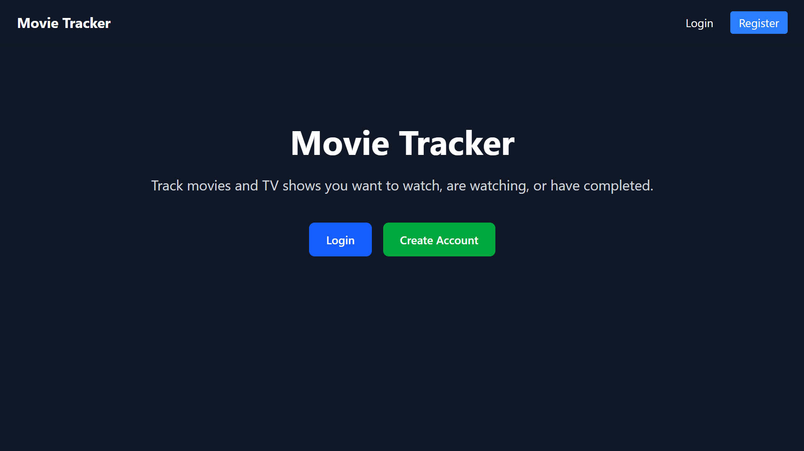
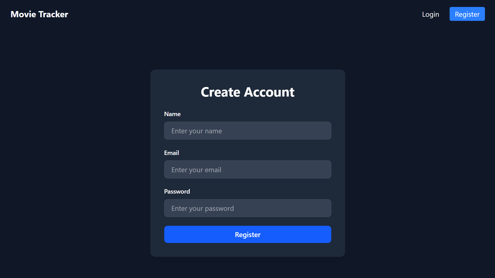
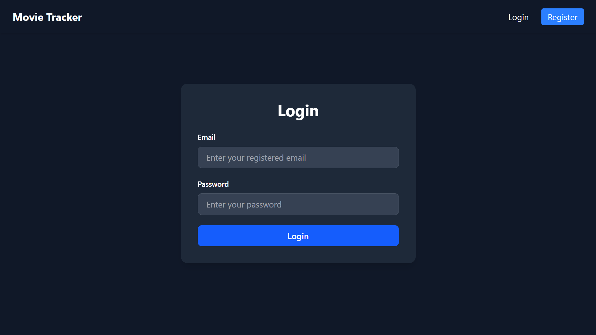
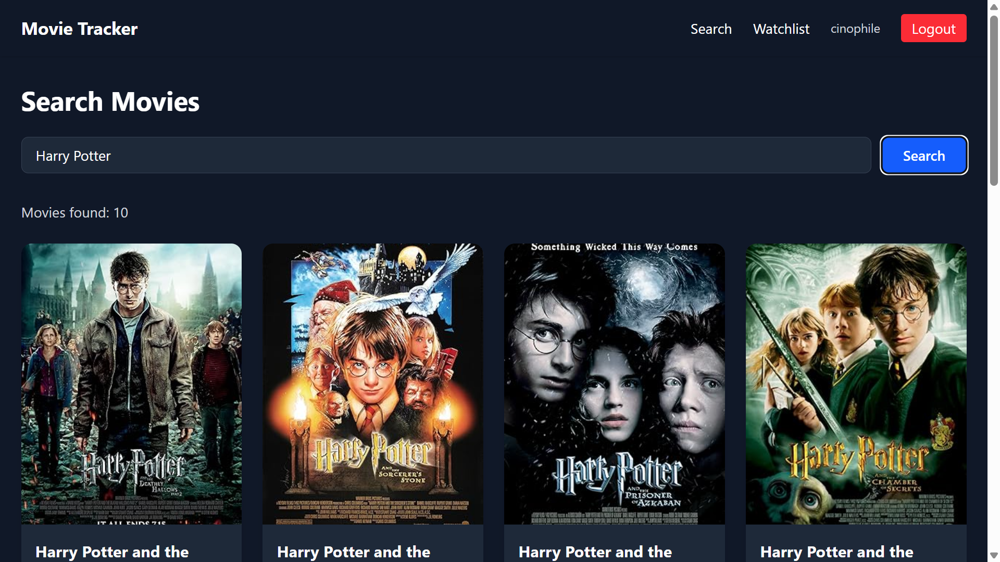
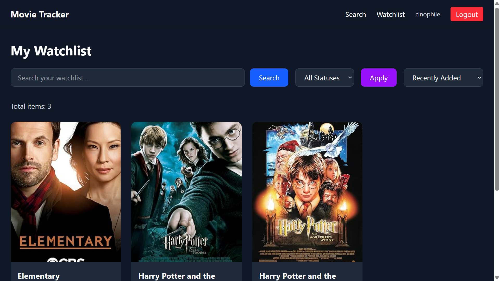

# Screen Shelf

A full-stack movie and TV series tracking application where users can search titles, manage a personal watchlist, and organize what they are watching.

## Live Demo

Frontend: [https://movie-tracker-livid-sigma.vercel.app](https://movie-tracker-livid-sigma.vercel.app)
Backend API: [https://movie-tracker-cb6f.onrender.com](https://movie-tracker-cb6f.onrender.com)

---

# Features

* JWT Authentication
* Register and Login
* Search movies and series using OMDb API
* Personal watchlist management
* Update watching status
* Filter and sort watchlist
* Responsive UI
* Protected API routes
* Cloud deployment with Vercel and Render

---

# Tech Stack

## Frontend

* React
* Vite
* Axios
* CSS

## Backend

* Node.js
* Express.js
* MongoDB
* Mongoose
* JWT Authentication

## Deployment

* Vercel
* Render
* MongoDB Atlas

---

# Installation

## Clone Repository

```bash
git clone https://github.com/Piyush-Jangde/movie-tracker
cd movie-tracker
```

## Backend Setup

```bash
cd backend
npm install
```

Create `.env` inside backend:

```env
PORT=5000
MONGO_URI=your_mongodb_uri
JWT_SECRET=your_secret_key
OMDB_API_KEY=your_omdb_api_key
CLIENT_URL=http://localhost:5173
```

Run backend:

```bash
npm run dev
```

## Frontend Setup

```bash
cd frontend
npm install
```

Create `.env` inside frontend:

```env
VITE_API_URL=http://localhost:5000/api
```

Run frontend:

```bash
npm run dev
```

---

# Screenshots

# Screenshots

## Home Page



## Register Page



## Login Page



## Search Movies



## Watchlist Dashboard



---

# Future Improvements

* Pagination
* Debounced search
* Movie details page
* Ratings and reviews
* TMDB integration
* Dark mode
* Toast notifications

---

# Author

Piyush Jangde
B.Tech Agricultural and Food Engineering, IIT Kharagpur
